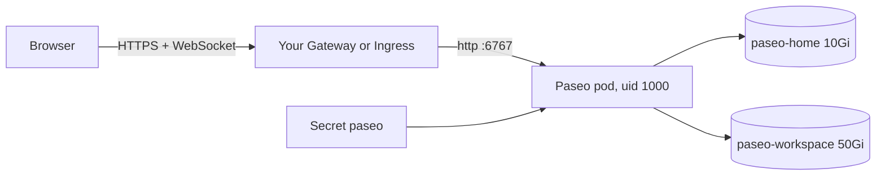

# Run Paseo on your Kubernetes cluster

**Purpose:** deploy the `paseo-dev` image on any Kubernetes cluster with plain manifests.
**Scope:** one namespace, two volumes, one pod, one route. No Argo CD, secret operator, or backup tool is required.
**Image guide:** [images/paseo-dev/README.md](../../../images/paseo-dev/README.md) explains connecting, logins, and Pi.
**Full GitOps example:** [talos-argocd-proxmox/my-apps/development/paseo](https://github.com/mitchross/talos-argocd-proxmox/tree/main/my-apps/development/paseo).



## What you need

- A cluster with an `amd64` node. The image has no `arm64` build.
- A default StorageClass that provides `ReadWriteOnce` volumes.
- An HTTPS Gateway (Gateway API) or Ingress controller that passes WebSockets.
- A DNS name for Paseo, for example `paseo.example.com`.
- `kubectl` with access to the cluster.

## Files

| File | Creates |
|---|---|
| `namespace.yaml` | Namespace `paseo` with the `restricted` Pod Security level |
| `pvc.yaml` | `paseo-home` (logins, settings) and `paseo-workspace` (your code) |
| `deployment.yaml` | One Paseo pod, `Recreate` updates, non-root, no service-account token |
| `service.yaml` | Service `paseo`, port `6767` named `http` |
| `httproute.yaml` | Gateway API route (default) |
| `ingress.yaml` | Ingress alternative for ingress-nginx |
| `pi-models.example.json` | Optional Pi model list for your own LLM server |

## 1. Get the files

```bash
git clone https://github.com/mitchross/homelab-images.git
cd homelab-images/deploy/kubernetes/paseo
```

## 2. Edit three things

1. Replace `paseo.example.com` in `deployment.yaml` and in `httproute.yaml` (or `ingress.yaml`).
2. Set `parentRefs` in `httproute.yaml` to your Gateway and its HTTPS listener.
3. Pin the image to a digest:

   ```bash
   docker buildx imagetools inspect ghcr.io/mitchross/paseo-dev:main | grep Digest
   ```

   Put the result in `deployment.yaml`: `ghcr.io/mitchross/paseo-dev:main@sha256:<digest>`.

**Ingress instead of Gateway API:** in `kustomization.yaml`, replace `httproute.yaml` with `ingress.yaml`.
Set `ingressClassName` and the TLS `secretName` for your cluster.

## 3. Create the password Secret

Keep the password out of Git. Create the Secret by hand:

```bash
kubectl apply -f namespace.yaml
PASEO_PASSWORD="$(openssl rand -base64 32)"
kubectl -n paseo create secret generic paseo --from-literal=PASEO_PASSWORD="$PASEO_PASSWORD"
echo "$PASEO_PASSWORD"
```

Save the printed password in your password manager. The pod does not start without this Secret.

## 4. Deploy

```bash
kubectl apply -k .
kubectl -n paseo rollout status deployment/paseo --timeout=10m
```

The first start pulls a large image. Expect `deployment "paseo" successfully rolled out`.

## 5. Check it

```bash
kubectl -n paseo get pod,pvc
curl -s -o /dev/null -w '%{http_code}\n' https://paseo.example.com/api/health
curl -s -o /dev/null -w '%{http_code}\n' https://paseo.example.com/api/status
curl -s https://paseo.example.com/ | grep -o '"useTls":[a-z]*'
```

| Result | Meaning |
|---|---|
| Pod `1/1 Running`, both PVCs `Bound` | The pod and volumes are ready |
| `200`, then `401` | Health works; the API needs the password |
| `"useTls":true` | The browser connects by itself |
| `"useTls":false` | Add your proxy's address range to `PASEO_TRUSTED_PROXIES` |
| `403` | The hostname is missing from `PASEO_HOSTNAMES` |

## 6. Connect and log in

Follow [First connection](../../../images/paseo-dev/README.md#first-connection) and
[One-time logins](../../../images/paseo-dev/README.md#one-time-logins) in the image guide.
GitHub, Claude Code, and Codex logins stay on `paseo-home`.

## 7. Optional: Pi with your own LLM server

The image seeds Pi with providers for the author's cluster. They do not work on yours.
Give Pi your own OpenAI-compatible server (vLLM, llama.cpp, Ollama, LiteLLM):

1. Edit `pi-models.example.json`: set `baseUrl`, the model `id`, and the token limits.
2. Store the server's key: `kubectl -n paseo create secret generic pi-llm --from-literal=MY_LLM_API_KEY='<key>'`.
   Use any non-empty value if your server has no key.
3. Add this to `kustomization.yaml`:

   ```yaml
   configMapGenerator:
     - name: pi-config
       files:
         - models.json=pi-models.example.json
   ```

4. In `deployment.yaml`, add to `env`:

   ```yaml
   - name: MY_LLM_API_KEY
     valueFrom:
       secretKeyRef:
         name: pi-llm
         key: MY_LLM_API_KEY
   ```

5. Add to `volumeMounts`:

   ```yaml
   - name: pi-config
     mountPath: /home/paseo/.pi/agent/models.json
     subPath: models.json
     readOnly: true
   ```

6. Add to `volumes`:

   ```yaml
   - name: pi-config
     configMap:
       name: pi-config
   ```

7. Run `kubectl apply -k .`.
8. In the Paseo terminal, run `pi --model my-llm/my-model -p "say ok"`.

Write `apiKey` as `"$MY_LLM_API_KEY"`, with the `$`. Pi sends a bare name as the literal key.
Pi's first-boot `settings.json` still names the author's default model. Pick yours with `/model` in Pi.

## Backups

These manifests include no backups. Snapshot both PVCs with your storage tool, or with Velero.
Push code to Git often. `paseo-home` holds logins, so restoring it saves a new round of logins.

## Security

- Paseo has one password and no login rate limit. Prefer a VPN, LAN-only route, or an identity proxy.
- A `gh auth login` in the pod can reach every repo of that account. Use a fine-grained token for less access.
- Agents can read both volumes and reach anything the pod network allows.
- The pod has no Kubernetes service-account token, so agents cannot call the Kubernetes API.

## Update and roll back

1. Find the new digest with the command in step 2.
2. Change it in `deployment.yaml`.
3. Run `kubectl apply -k .`.

To roll back, put the old digest back and apply again. The volumes stay.

**Warning:** `kubectl delete namespace paseo` deletes both PVCs with your logins and code.
