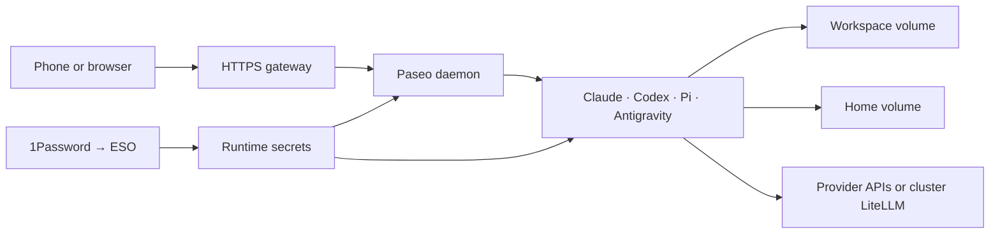

# Paseo development image

Use this image to run Paseo and coding agents in your Kubernetes cluster.
The image contains tools. Persistent volumes contain your projects and agent data.



## What is installed

| Component | Purpose |
| --- | --- |
| Official Paseo base | Daemon and web interface |
| Claude Code, Codex, Pi, Antigravity CLI | Run coding agents |
| Node 24, npm, pnpm, Bun | JavaScript and React development |
| Python, uv, GDAL, ecCodes | Python and geospatial development |
| Rust, Go, .NET, Java, Maven, Gradle | Compile and test projects |
| Chromium | Browser automation |
| kubectl, Helm, Kustomize, Argo CD, Talos, Omni, Cilium | Cluster operations |
| GitHub CLI, Docker CLI, 1Password CLI, Temporal CLI | External tools |

The image supports `linux/amd64`. It runs as user and group `1000:1000`.
Paseo uses the Node runtime from its base image. Development commands use Node 24.
Claude auto-updates are disabled. Update Claude through a new image build.

See [Dockerfile](Dockerfile), [mise.toml](mise.toml), and
[Pi package pins](pi-packages/package.json) for exact versions.

## Build and test

Run these commands from the repository root:

```sh
docker build --platform linux/amd64 -t paseo-dev:local images/paseo-dev
bash scripts/test-paseo.sh paseo-dev:local
```

The tests use an empty home directory and the runtime user. They check the tools,
Pi startup, a Cargo dependency build, the daemon's Node runtime, the web interface,
and HTTP password authentication. They do not test provider logins, voice, or live
cluster permissions.

To build, test, and publish from CachyOS:

```sh
bash scripts/publish-paseo-local.sh
```

Commit your changes first. The GitHub CLI token must have package write access.
Docker keeps local build layers. GHCR receives only layers that it does not have.
The script prints the published digest. Use that digest in the deployment PR.
Local builds do not populate the GitHub Actions cache.

## Storage and secrets

| Path or value | Required setup |
| --- | --- |
| `/home/paseo` | Writable persistent volume for settings, sessions, and logins |
| `/workspace` | Writable persistent volume for project checkouts |
| `PASEO_PASSWORD` | Runtime secret; required for normal daemon startup |
| `LITELLM_API_KEY` | Runtime secret for the seeded Pi LiteLLM providers |
| `OPENROUTER_API_KEY` | Optional runtime secret for direct OpenRouter access |
| Provider login | Authenticate each agent on the deployed host |
| Infrastructure credentials | Grant access separately for each target service |

Keep credentials out of the image and Git. ESO supplies Kubernetes Secrets from
1Password. Installing a CLI does not grant permission to its service.

Expose port `6767` through an HTTPS gateway that supports WebSockets. Set
`PASEO_ALLOWED_HOSTNAMES` for the deployed hostname. Use `/api/health` for probes.
Relay access and service publishing are disabled by default.

## Agent settings, skills, and memory

On first use, the entrypoint copies Pi settings and model definitions into the
home volume. Later starts preserve those files. An image update does not overwrite
existing Pi settings.

The seeded LiteLLM URL is
`http://litellm-service.litellm.svc.cluster.local:4000/v1`. It requires cluster DNS.
For use outside the cluster, change the runtime model configuration.

Keep personal skills, rules, and sanitized plugin manifests in a private
configuration repository. Restore them into the home volume. Recreate skill links
for `/home/paseo`; workstation links to `/home/vanillax` will not work here.
Project instructions arrive with each project checkout.

Paseo keeps agent state and resumes provider sessions. It does not supply a shared
Mink knowledge store. Mink files and integration settings need their own migration
and backup plan. This image does not install or copy Mink.

Review hooks and MCP definitions before enabling them. Supply their credentials
at runtime. Desktop bridges and connected-app skills may need services that are
absent from the container. No third-party Paseo plugins are enabled.

## Updates and rollback

Renovate proposes base image, tool, agent, and Action updates. Coding agent updates
are grouped weekly. The mise bootstrap, 1Password checksum pair, and Antigravity
release manifest require manual updates.

GitHub Actions builds and tests candidate images before publishing. Scheduled
builds disable the build cache to refresh OS packages. Main builds also update the
`main` image tag. Deployment changes belong in `talos-argocd-proxmox`.

Pin the deployment to an image digest. Back up both volumes before an upgrade
that changes stored data. To roll back, restore the previous image digest. Restore
volume data too if the newer version made an incompatible data change.

## Limits

- The Docker CLI needs a remote engine. The image does not run a Docker daemon.
- iOS and watch builds need a Mac runner.
- Antigravity needs its own login. Paseo uses it in full-access mode.
- Tools do not include your local histories, credentials, or private configuration.
- Keep cluster access scoped to the work that the agents must perform.
