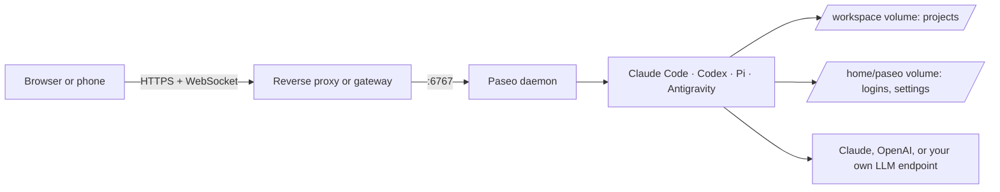

# Paseo development image

This image runs [Paseo](https://github.com/getpaseo/paseo) with coding agents and
developer tools. Open Paseo in a browser and drive Claude Code, Codex, or Pi on your
own server. Your projects and logins live on two persistent volumes.



This guide works for any homelab. Values such as `paseo.vanillax.me` and
`vanillax-vllm` are examples from the author's setup. Replace them with yours.

## What is installed

| Component | Purpose |
| --- | --- |
| Official Paseo base | Daemon and web interface |
| Claude Code, Codex, Pi, Antigravity CLI | Coding agents |
| Node 24, npm, pnpm, Bun | JavaScript and React development |
| Python, uv, GDAL, ecCodes | Python and geospatial development |
| Rust, Go, .NET, Java, Maven, Gradle | Compile and test projects |
| Chromium | Browser automation |
| kubectl, Helm, Kustomize, Argo CD, Talos, Omni, Cilium | Cluster operations |
| GitHub CLI, Docker CLI, 1Password CLI, Temporal CLI | External tools |

The image supports `linux/amd64` only. Processes run as user and group `1000:1000`.
The Paseo daemon uses the base image's Node runtime. Your shell commands use Node 24.
Claude Code auto-updates are off. A new image build updates Claude Code.

Exact versions live in the [Dockerfile](Dockerfile), [mise.toml](mise.toml), and
[Pi package pins](pi-packages/package.json).

## Quick start with Docker Compose

The published image is `ghcr.io/mitchross/paseo-dev`. Pin a digest for anything
you rely on; the `main` tag moves with each build.

1. Generate a long random password: `openssl rand -base64 24`.
2. Save this as `compose.yaml`:

   ```yaml
   services:
     paseo:
       image: ghcr.io/mitchross/paseo-dev:main
       restart: unless-stopped
       ports:
         - "6767:6767"
       environment:
         PASEO_PASSWORD: "change-me"           # use your generated password
         PASEO_HOSTNAMES: "paseo.example.com"  # every DNS name you use to reach Paseo
         # LITELLM_API_KEY: "..."              # only for the seeded Pi providers
       volumes:
         - paseo-home:/home/paseo
         - paseo-workspace:/workspace
   volumes:
     paseo-home:
     paseo-workspace:
   ```

3. Run `docker compose up -d`.
4. Open `http://<server-ip>:6767`.

Named volumes take the image's `1000:1000` ownership. If you use bind mounts
instead, run `sudo chown -R 1000:1000` on both directories first.

The container refuses to start without `PASEO_PASSWORD`. IP addresses and
`localhost` always work. A DNS name gives `403 Host not allowed` until you add it
to `PASEO_HOSTNAMES`.

## Kubernetes

**Step-by-step guide with ready manifests:** [deploy/kubernetes/paseo](../../deploy/kubernetes/paseo/README.md).

A complete GitOps example lives in
[talos-argocd-proxmox/my-apps/development/paseo](https://github.com/mitchross/talos-argocd-proxmox/tree/main/my-apps/development/paseo).
It uses Argo CD, External Secrets, Longhorn, and Kopiur backups. Copy what fits.

Required pieces:

| Piece | Setting |
| --- | --- |
| Deployment | 1 replica, `strategy: Recreate`, `runAsUser: 1000`, `runAsGroup: 1000`, `fsGroup: 1000` |
| Volumes | One PVC at `/home/paseo`, one PVC at `/workspace`, both `ReadWriteOnce` |
| Secret | `PASEO_PASSWORD` from a Kubernetes Secret, never a plain value in Git |
| Env | `PASEO_HOSTNAMES` with your public hostname |
| Service | Port `6767`, named `http` |
| Route | HTTPS with WebSocket upgrades to the Service |
| Probes | Startup and readiness on `GET /api/health`; skip liveness so busy builds are not killed |
| Shared memory | `emptyDir` with `medium: Memory` at `/dev/shm` for Chromium |

Use `Recreate`, not `RollingUpdate`. Two pods cannot attach the same RWO volume.
Set `automountServiceAccountToken: false` unless you want agents to reach the
Kubernetes API.

Behind a TLS-terminating proxy, Paseo trusts `X-Forwarded-Proto` only from
`loopback` by default. Set `PASEO_TRUSTED_PROXIES` to your proxy's addresses, for
example `loopback,uniquelocal`, so the web page detects that it runs on HTTPS.

## First connection

1. Open your Paseo URL.
2. If the browser asks to "access other apps and services on this device", click **Block**.
3. Click **Direct connection**. Ignore **Paste pairing link**; that is the relay, and it is off.
4. Enter your host, for example `paseo.example.com`.
5. Enter port `443` and turn on **Use SSL** behind HTTPS.
   On a plain LAN address, use port `6767` with **Use SSL** off.
6. Enter your `PASEO_PASSWORD` and click **Connect**.

The web page loads without a password. All agent control needs the password.

## One-time logins

Do every login once, in Paseo's own terminal. Logins persist in `/home/paseo`,
so restarts and image updates keep them.

### Open a terminal

1. Click **Add project** → **Search for directory**.
2. Type `/workspace` and press Enter.
3. In the new workspace, change **Chat ⌄** (top right) to **Terminal**.
4. Leave the command box empty and press Enter.

The pod has no browser. Open every login link on your own computer.

### GitHub

1. Run `gh auth login --hostname github.com --git-protocol https --web`.
2. Answer **Yes** to "Authenticate Git with your GitHub credentials?".
3. Ignore the clipboard and `xdg-open` errors. Copy the one-time code from the terminal.
4. Open `https://github.com/login/device` on your computer and enter the code.
5. Wait for `Logged in as <you>` in the terminal.
6. Set your commit identity. The GitHub noreply address keeps your email private:

   ```sh
   git config --global user.name "Your Name"
   git config --global user.email "<username>@users.noreply.github.com"
   ```

This login can read and write every repository your account can. See
[Security checklist](#security-checklist) for a narrower token.

### Claude Code

1. Run `claude`.
2. Accept the theme and folder-trust prompts.
3. Type `/login` and choose **Claude account with subscription**.
4. Open the printed link on your computer and approve.
5. Paste the code back into the terminal.
6. Type `/exit`.

A subscription login uses your plan's limits, the same as Claude Code on your
computer. It does not use API credit.

### Codex

1. Open ChatGPT → **Settings** → **Security and login**.
2. Turn on **device code sign-in** for Codex.
3. Run `codex login --device-auth`.
4. Open the printed link on your computer and enter the code.
5. Wait for `Successfully logged in`.

Codex rejects the code until step 2 is done.

### Check

```sh
gh auth status; claude --version; codex login status
```

## Pi and your own models

Pi reads its model list from `~/.pi/agent/models.json`. On first start, the image
copies [config/pi-models.json](config/pi-models.json) there. Later starts keep
your copy, so image updates never overwrite it.

The seeded file points at the author's in-cluster LiteLLM. Replace it with your
own OpenAI-compatible endpoint, such as LiteLLM, vLLM, llama.cpp, or Ollama:

```json
{
  "providers": {
    "my-llm": {
      "baseUrl": "http://my-llm-server:8000/v1",
      "api": "openai-completions",
      "apiKey": "$MY_LLM_API_KEY",
      "models": [
        {
          "id": "my-model",
          "name": "My model",
          "contextWindow": 131072,
          "maxTokens": 16384
        }
      ]
    }
  }
}
```

Use one of these to install it:

- Edit `~/.pi/agent/models.json` in the Paseo terminal. It lives on the home volume.
- Mount your file read-only at `/home/paseo/.pi/agent/models.json`. Git then owns it.

Then pick your default model. In Pi, run `/model`, select yours, and press `Ctrl+S`.
Only `id` is required per model; the other fields refine limits.

**`apiKey` gotcha.** `apiKey` accepts a literal key, `$NAME` or `${NAME}` for an
environment variable, or `!command`. A bare `MY_LLM_API_KEY` is a literal string.
Pi then sends that text as the key. LiteLLM answers `400 No connected db`,
because it looks for the unknown key in a database it does not have.

Test Pi from the Paseo terminal:

```sh
pi -p "Reply with exactly: OK"
```

### Pi launchers

Interactive bash terminals in the image define these aliases:

| Alias | Model |
| --- | --- |
| `pi-qwen-only` | `vanillax-vllm/qwen3.8-27b`, thinking `xhigh` |
| `pi-withflash` | `vanillax-auto/pi-auto`, LiteLLM picks local or cloud |
| `pi-flash` | `vanillax-openrouter/deepseek-flash`, thinking `high` |

They use the seeded provider names. With your own providers, add your aliases
to `~/.bashrc`. That file lives on the home volume and loads after the image's.

## Security checklist

Paseo gives anyone with the password a shell with your logins. Treat it like SSH.

- Use a long random password. Paseo does not rate-limit failed logins.
- Prefer an identity gate in front, such as Cloudflare Access or a VPN like Tailscale.
  A bare password on a public hostname is the weakest option.
- Replace the full `gh` login with a fine-grained personal access token for the
  repositories agents need: `gh auth login --with-token`.
- Protect deploy branches with a ruleset. A pod token that can push to your GitOps
  branch can deploy anything to your cluster.
- Agents can read everything on both volumes and reach anything the network allows.
  Mount only what they need. Restrict pod egress where you can.
- Set a monthly spend limit at every paid provider, for example OpenRouter.
- Keep the relay off unless you use it. The image sets `PASEO_RELAY_ENABLED=false`.

## Agent settings, skills, and memory

Keep personal skills, rules, and plugin manifests in a private repository.
Restore them into the home volume. Rewrite workstation paths for `/home/paseo`
and `/workspace`. Project instructions arrive with each project checkout.

Paseo keeps agent state and resumes provider sessions. It has no shared knowledge
store. The image does not install or copy Mink.

Review hooks and MCP definitions before you enable them. Supply their credentials
at runtime. Desktop bridges may need services that the container does not have.
The image enables no third-party Paseo plugins. Review these before you opt in:

| Plugin | Use |
| --- | --- |
| [Shared Browser](https://github.com/omercnet/paseo-plugins/tree/main/paseo-shared-browser) | Share a workspace browser between agents and your phone. Needs Node 24 and a prepared Chromium runtime. |
| [PR Radar](https://github.com/omercnet/paseo-plugins/tree/main/pr-radar) | Track workspace PRs and checks. Needs an authenticated `gh`. |
| [Agent Monitor](https://github.com/omercnet/paseo-plugins/tree/main/agent-monitor) | Triage agents across workspaces. |

Plugins run with the daemon user's credentials and network access. Pin and test the versions you choose.

## Build and test

Run these commands from the repository root:

```sh
docker build --platform linux/amd64 -t paseo-dev:local images/paseo-dev
bash scripts/test-paseo.sh paseo-dev:local
```

The tests run as the runtime user with an empty home. They check the tools, Pi
startup, the Pi launchers, a Cargo dependency build, the daemon's Node runtime,
the web interface, and password authentication. They do not test provider logins,
voice, or cluster permissions.

To build, test, and publish from a workstation:

```sh
bash scripts/publish-paseo-local.sh
```

Commit your changes first. The GitHub CLI token needs package write access.
To read the token from 1Password, set `GHCR_TOKEN_REF` to its `op://` reference.
Set `GHCR_USERNAME` if the package owner differs from your GitHub CLI user.
Never type the token value in a command. The script prints the published digest.

## Updates and rollback

Renovate proposes base image, tool, agent, and Action updates. It groups coding
agent updates weekly. Update the mise bootstrap, the 1Password CLI checksum pair,
and the Antigravity release manifest by hand.

GitHub Actions builds and tests each image before it publishes. Weekly builds
skip the cache to refresh OS packages. Builds on `main` also move the `main` tag.

Pin your deployment to an image digest. Back up both volumes before an upgrade
that changes stored data. To roll back, deploy the previous digest. Restore the
volumes too if the newer version changed stored data.

## Limits

- The Docker CLI needs a remote engine. The image does not run a Docker daemon.
- iOS and watch builds need a Mac runner.
- Antigravity needs its own login. Paseo runs it in full-access mode.
- The image contains no histories, credentials, or private configuration.
- Keep cluster access scoped to the work the agents must do.
