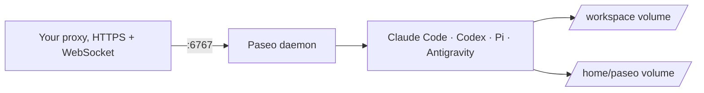

# Paseo development image

`ghcr.io/mitchross/paseo-dev` runs [Paseo](https://github.com/getpaseo/paseo) with coding agents and developer tools.

**Deploy it:** the deployment docs live in [talos-argocd-proxmox](https://github.com/mitchross/talos-argocd-proxmox):

| Guide | Use it to |
| --- | --- |
| [Paseo: coding agents in the cluster](https://github.com/mitchross/talos-argocd-proxmox/blob/main/docs/domains/ai-gpu/paseo.md) | See how this image runs in the author's cluster: connect, logins, Pi |
| [Run Paseo on another cluster](https://github.com/mitchross/talos-argocd-proxmox/blob/main/docs/domains/ai-gpu/paseo-other-clusters.md) | Run it in your homelab with Docker Compose or plain Kubernetes manifests |



## What is installed

| Component | Purpose |
| --- | --- |
| Official Paseo base | Daemon and web interface |
| Claude Code, Codex, Pi, Antigravity CLI | Coding agents |
| Node 24, npm, pnpm, Bun | JavaScript and React development |
| Python, uv, GDAL, ecCodes | Python and geospatial development |
| Rust, Go, .NET, Java, Maven, Gradle | Compile and test projects |
| Chromium | Browser automation |
| kubectl, Helm, Kustomize, Argo CD, Talos, Omni, Cilium | Cluster operations |
| GitHub CLI, Gitea CLI (`tea`), Docker CLI, 1Password CLI, Temporal CLI | External tools |
| Mink, chezmoi, crane | Shared agent memory, dotfiles, registry digest lookups |

Exact versions live in the [Dockerfile](Dockerfile), [mise.toml](mise.toml), and
[Pi package pins](pi-packages/package.json).

## Runtime contract

| Item | Value |
| --- | --- |
| Platform | `linux/amd64` only |
| User | `1000:1000`, non-root |
| Port | `6767`, HTTP and WebSocket; health at `GET /api/health` |
| Volumes | `/home/paseo` (logins, settings) and `/workspace` (code) |
| Required env | `PASEO_PASSWORD`; the container exits without it |
| Optional env | `PASEO_HOSTNAMES`, `PASEO_TRUSTED_PROXIES`, `PASEO_RELAY_ENABLED` (default `false`) |
| Optional runtime config | `GITEA_URL` + `GITEA_TOKEN` (+ `GITEA_LOGIN_NAME`, `GITEA_USER`); `PASEO_MANAGED_CONFIG` (path to a JSON file) |

The Paseo daemon uses the base image's Node runtime. Shell commands use Node 24 from mise.
Claude Code and Mink auto-updates are off. A new image build updates them.
Keep `MINK_VERSION` equal to the workstations' Mink, or Mink regenerates the repos' hook files.

## First-boot seeds and launchers

On first start, the entrypoint copies [config/pi-settings.json](config/pi-settings.json) and
[config/pi-models.json](config/pi-models.json) into `~/.pi/agent/`. Later starts keep the user's copies.
The seeded providers point at the author's in-cluster LiteLLM. Write their `apiKey` values as
`"$NAME"`: Pi sends a bare name as the literal key.

Interactive bash loads [config/pi-aliases.sh](config/pi-aliases.sh) from `/etc/bash.bashrc`:
`pi-qwen-only`, `pi-withflash`, and `pi-flash`. They use the seeded provider names.

## Runtime config applied on every start

Unlike the seeds, these steps run on every start. Changes in the Secret or the mounted file apply after a restart.

| Input | Result |
| --- | --- |
| `GITEA_URL` and `GITEA_TOKEN` | The entrypoint replaces the `tea` login named `GITEA_LOGIN_NAME` (default `gitea`) and sets `!tea login helper` as the Git credential helper for that URL. Paseo detects Gitea from `tea login list`. |
| `PASEO_MANAGED_CONFIG` | The entrypoint deep-merges that JSON over `$PASEO_HOME/config.json`. Keys in the file win, and arrays are replaced. Other keys keep the user's values. |

The daemon rejects unknown config keys, so test a managed file with `paseo daemon config set` first.

## Build and test

Run these commands from the repository root:

```sh
docker build --platform linux/amd64 -t paseo-dev:local images/paseo-dev
bash scripts/test-paseo.sh paseo-dev:local
```

The tests run as the runtime user with an empty home. They check the tools, Pi
startup, the Pi launchers, a Cargo dependency build, the daemon's Node runtime,
the web interface, and password authentication. They do not test provider logins,
voice, or cluster permissions.

To build, test, and publish from a workstation:

```sh
bash scripts/publish-paseo-local.sh
```

1. Commit your changes first.
2. Give the GitHub CLI token package write access.
3. To read the token from 1Password, set `GHCR_TOKEN_REF` to its `op://` reference.
4. Set `GHCR_USERNAME` if the package owner differs from your GitHub CLI user.

Never type the token value in a command. The script prints the published digest.

## Updates

Renovate proposes base image, tool, agent, and Action updates. It groups coding
agent updates weekly. Update the mise bootstrap, the 1Password CLI checksum pair,
and the Antigravity release manifest by hand.

GitHub Actions builds and tests each image before it publishes. Weekly builds
skip the cache to refresh OS packages. Builds on `main` also move the `main` tag.
Deployments pin a digest. The deploy guides above describe the update and rollback steps.

## Limits

- The Docker CLI needs a remote engine. The image does not run a Docker daemon.
- iOS and watch builds need a Mac runner.
- Antigravity needs its own login. Paseo runs it in full-access mode.
- The image contains no histories, credentials, or private configuration.
