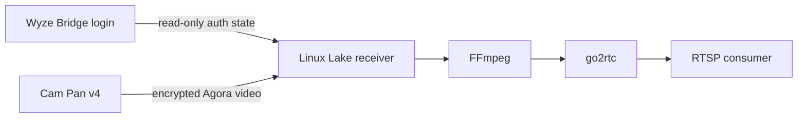

# Wyze Lake receiver

Receive Cam Pan v4 video with Agora's native Linux SDK. Publish H265 video through a local go2rtc RTSP server.



This image receives video. Wyze Bridge maintains the account login and refreshes the authentication state.
Find deployment manifests in [talos-argocd-proxmox](https://github.com/mitchross/talos-argocd-proxmox/tree/main/my-apps/home-automation/wyze-bridge).

## Build and test

Run these commands from the repository root:

```sh
docker build --platform linux/amd64 -t wyze-lake:local images/wyze-lake
bash scripts/test-wyze-lake.sh wyze-lake:local
```

The test loads the native SDK without network access. It decodes generated H265 video through RTSP.
The test uses UID 1000, an empty home, and a read-only root filesystem.
It does not contact a camera or prove account authentication.

The workflow builds and tests before publishing an immutable revision tag.
Copy the published digest from its job summary for deployment review.

## Runtime contract

| Setting | Requirement |
| --- | --- |
| `WYZE_AUTH_STATE` | Required path to Wyze Bridge's JSON state file, mounted read-only. |
| `WYZE_CAMERA_NAME` | Required camera nickname. The name must identify exactly one Cam Pan v4. |
| `WYZE_STREAM_NAME` | RTSP stream name. Default: `camera`. Use letters, numbers, underscores, or hyphens. |
| `WYZE_RTSP_PORT` | RTSP TCP listen port. Default: `8554`. |
| `WYZE_RUNTIME_DIR` | Writable directory for SDK logs, config, and heartbeat. Default: `/tmp/wyze-lake`. |
| `WYZE_RENEW_SECONDS` | Viewer token renewal interval. Default: 1800 seconds. Allowed range: 30–1800. |

The authentication file contains account access and refresh tokens. Keep it outside the image and build context.
Mount its containing directory so atomic file replacements remain visible. UID 1000 must have read access.
The receiver discovers the camera through Wyze's API. It needs no HAR file or saved camera identifiers.
It reads the authentication file again for each API call. Wyze Bridge must keep that file current.

Mount writable temporary storage at `/tmp`. Mount an empty writable home at `/home/wyze` when using a read-only filesystem.
Keep SDK logs private. The receiver creates its runtime directory with mode 0700.
Allow outbound HTTPS and the Agora SDK's network traffic.
RTSP has no authentication in this image. Restrict access through the deployment's network policy.
The go2rtc API listens on loopback only. WebRTC is disabled.

Read video at `rtsp://<receiver>:<port>/<stream>` over TCP.
Run `python3 /opt/wyze-lake/receiver.py --health` for the encoded-video heartbeat check.
The health check reports recent writes to the publisher. It does not prove consumer decoding.

## Recovery and limits

The receiver renews the viewer token and sends camera authorization controls every ten seconds.
It starts a fresh viewer after disconnects, queue overflow, or stalled video.
Retries use a delay of up to 30 seconds. A parent watchdog stops a viewer that stops updating its heartbeat.

Initial support is video-only, at 640×360. Only Cam Pan v4 with model `HL_PAN4` has been tested.
H265 browser playback depends on the consumer. Consumers can report missing references until the next keyframe after joining.
FFmpeg can correct timestamps during publisher startup. Live decoding was verified after startup and reconnects.
The image currently supports Linux amd64 only. It uses Wyze's undocumented web protocol, which can change.
No Android device is required.

## Update

Update pinned versions, URLs, image digests, and SHA256 values in the Dockerfile.
Keep the native SDK URL aligned with the Python wrapper's expected version file.
Rebuild the image. Run the image test with fresh storage.
Verify live decoding, token renewal, and reconnects with an authorized camera before changing deployment manifests.

Protocol references: [Agora Python SDK](https://github.com/AgoraIO-Extensions/Agora-Python-Server-SDK),
[go2rtc](https://github.com/AlexxIT/go2rtc), and Wyze's public client at [my.wyze.com](https://my.wyze.com).
